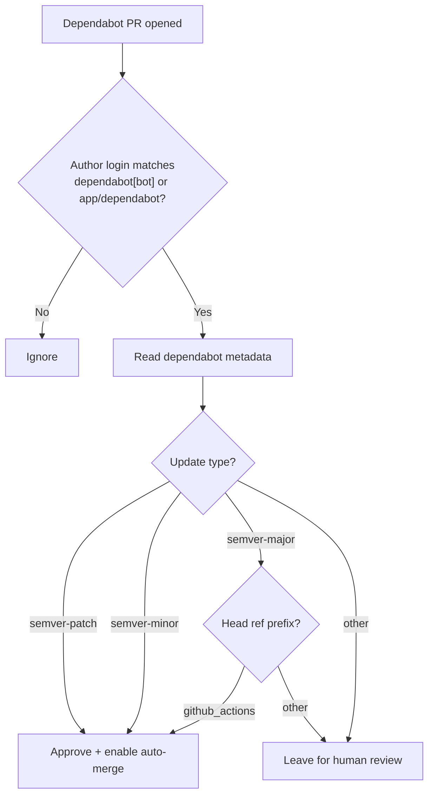
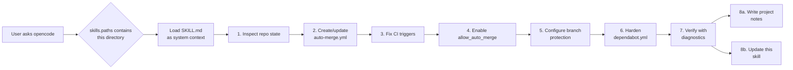
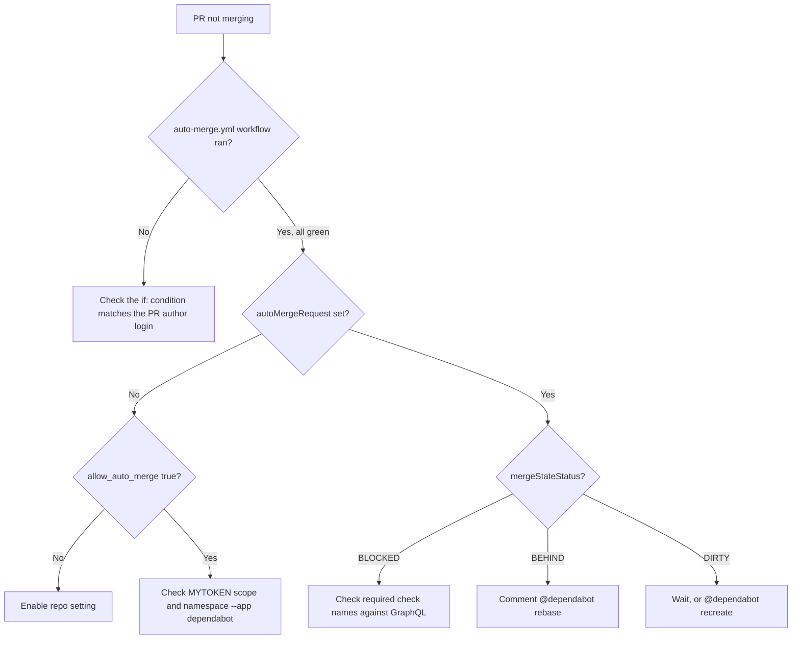

# dependabot-automerge-skill

An [opencode](https://opencode.ai) skill that configures GitHub Dependabot auto-merge for any repository.

It is built from real incident post-mortems: every "Pitfall" in `SKILL.md` is something that has actually broken in production. The skill is also self-improving — after each successful run it writes a per-project notes file and folds what it learned back into `SKILL.md`.

---

## What it does

When triggered, the skill:

1. **Inspects** the current repo state:
   - `.github/dependabot.yml`
   - existing workflows (`auto-merge.yml`, `build.yml`, etc.)
   - branch protection and required checks
   - open Dependabot PRs and their author login (`app/dependabot` vs `dependabot[bot]`)
   - available tokens and the `allow_auto_merge` repo flag
2. **Creates / updates** `.github/workflows/auto-merge.yml` with a safe merge policy.
3. **Fixes the CI trigger** so `build.yml` runs on `pull_request` and does not double-fire on `push`.
4. **Enables** `allow_auto_merge` at the repo level.
5. **Configures** branch protection with the *actual* required check names, discovered via GitHub GraphQL rather than guessed.
6. **Hardens** `dependabot.yml` (weekly schedule, sensible PR limits, labels — no catch-all `groups:`).
7. **Verifies** the setup with concrete diagnostics before reporting success:
   - `allow_auto_merge: false` detection
   - empty / unmasked `MYTOKEN` detection (`GH_TOKEN:` vs `GH_TOKEN: ***`)
   - `pull_request` vs `push` event gating check
   - duplicate check-name detection for split CI workflows
   - `patterns: ["*"]` anti-pattern check in `dependabot.yml`
   - `@dependabot rebase` smoke test for stuck existing PRs
   - post-rewrite `mergeStateStatus` check for `DIRTY` workflow-bump PRs
8. **Self-improves**: writes `<project>/docs/dependabot-optimization-notes.md` and updates this skill.

Default merge policy:

| Update type | Head ref | Action |
| --- | --- | --- |
| `semver-patch` | any | auto-merge |
| `semver-minor` | any | auto-merge |
| `semver-major` | `dependabot/github_actions/*` | auto-merge |
| `semver-major` | other (e.g. `dependabot/maven/*`) | human review |
| other | any | human review |



Rationale: GitHub Actions major versions are usually just Node runtime bumps; Maven majors can break the build. You can adapt the table per repo.

---

## When it triggers

The skill activates on Dependabot / auto-merge problems. Common triggers include:

| Category | Example phrases |
| --- | --- |
| Setup | "set up dependabot auto-merge", "optimize dependabot" |
| PR stuck | "PR stuck waiting for checks", "PR stuck BEHIND", "PR stuck DIRTY" |
| CI gating | "CI looks like it's running but isn't gating the PR", "branch protection required status check" |
| Token / permissions | "auto-merge returns 422", "MYTOKEN secret is set but auto-merge still fails", "actions secret vs dependabot secret" |
| Workflow issues | "auto-merge workflow never runs", "I changed auto-merge.yml and nothing happened" |
| Dependabot quirks | "app/dependabot vs dependabot[bot]", "dependabot grouped my major upgrades into one huge PR" |
| Edge cases | "no open dependabot PRs but I still want to verify MYTOKEN scope", "local clone is way behind origin and git status lies", "I added github-actions to dependabot.yml and now 4 PRs opened at once and are racing" |

See the `description` field in `SKILL.md` for the complete trigger list.

---

## Quick start

Register this directory as an external skill in your `opencode.json`:

```json
{
  "$schema": "https://opencode.ai/config.json",
  "skills": {
    "paths": ["/home/xenoamess/workspace/dependabot-automerge-skill"]
  }
}
```

Restart opencode. Then ask it to set up auto-merge for a repo, for example:

> "Set up dependabot auto-merge for my-java-project."

opencode will load `SKILL.md` as system context and follow the strategy, pitfalls, and verification checklist inside.

---

## How it works under the hood

opencode scans each path in `skills.paths` for `**/SKILL.md` and loads the matching file as system prompt context. That means:

- `SKILL.md` is the actual skill — the strategy, pitfalls, and verification steps all live there.
- `README.md` is human documentation; opencode does not read it automatically.
- Keeping the entire procedure in one file keeps the agent's prompt focused, with no extra navigation.



```
dependabot-automerge-skill/
├── SKILL.md   # loaded by opencode
└── README.md  # this file
```

---

## Self-improvement loop

After a successful run the skill:

1. Writes per-project notes to `<project>/docs/dependabot-optimization-notes.md`.
2. Updates `SKILL.md` and `README.md` with new pitfalls, trigger phrases, or verification checks.
3. Commits the skill changes locally (no remote push — the skill is loaded from a local path).

The skill's own git log is the audit trail of what was learned where — see the `### Worked example` subsections in `SKILL.md` for prior runs (`XenoAmess/docker-image-rebecca`, `XenoAmess/x8l_idea_plugin`, `cyanpotion/cyan_zip`, `XenoAmess/jcpp-maven-plugin`, `XenoAmess/evosuite`, `XenoAmess/XenoAmessBlogFramework`, `XenoAmess/XenoAmessBlog`, `XenoAmess-Auto/qr_code_simple`, `xenaomess-shade/shade_asm`).

---

## Troubleshooting at a glance

When a Dependabot PR is not merging, the skill follows this decision tree:



The detailed symptoms, causes, and fixes for each branch are in the Pitfalls section of `SKILL.md`.

---

## Contributing

The skill is a single Markdown file so changes stay reviewable in one diff:

- **Bug / new pitfall you hit?** Add it to the Pitfalls section in `SKILL.md`, plus a diagnostic command and a fix.
- **New trigger phrase users actually say?** Add it to both the `description` frontmatter and the "When to use" list.
- **README only?** Formatting, examples, or clarifications are welcome here.

When editing, keep the same style: concrete symptom → cause → fix → diagnostic command.

---

## License

Same as the originating repo (`java_pojo_generator`, MIT).
