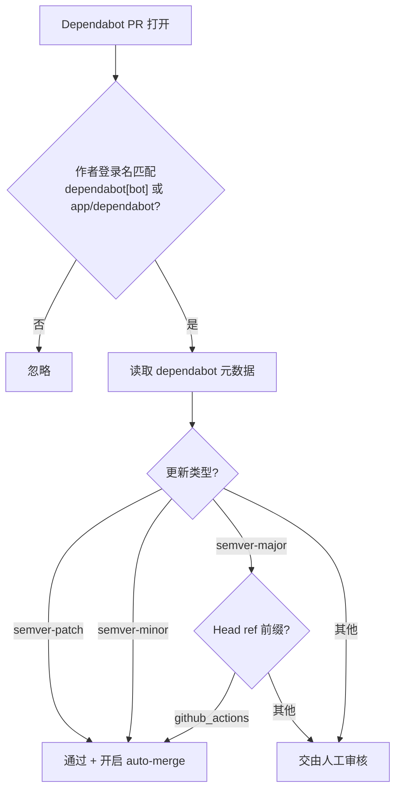
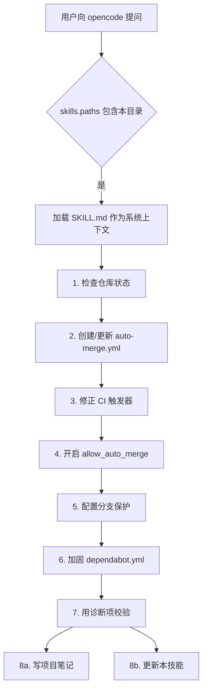
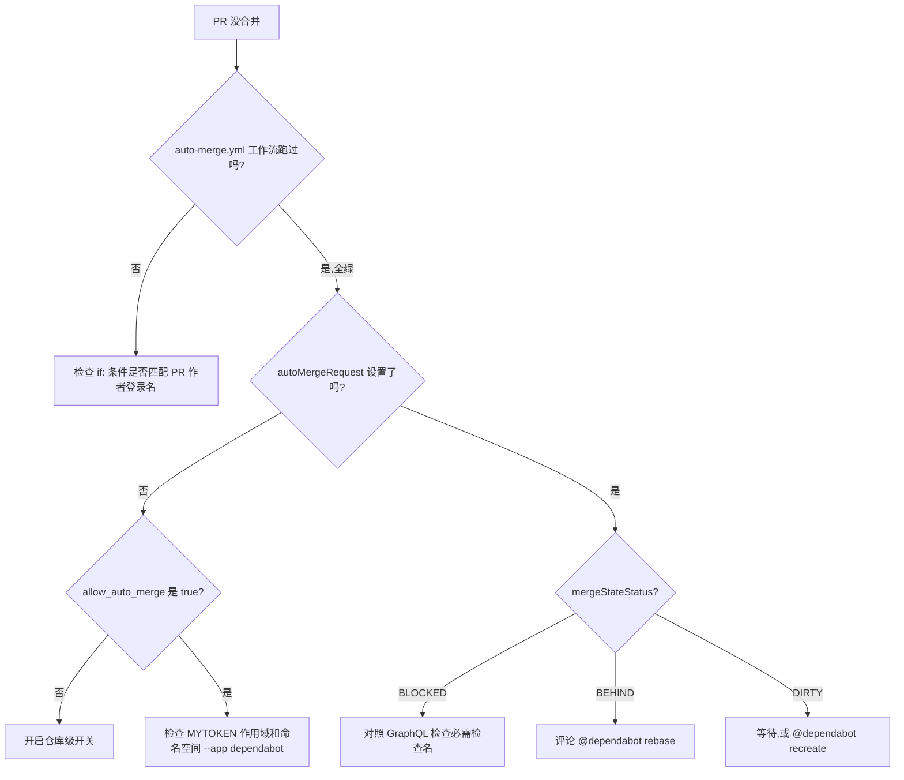

# dependabot-automerge-skill

> [English](README.md) | **简体中文**

一个 [opencode](https://opencode.ai) 技能（skill），用于为任意 GitHub 仓库配置 Dependabot 自动合并。

它源自真实的事故复盘：`SKILL.md` 中列出的每一条 "Pitfall"（坑）都是生产环境里真实翻过车的场景。该技能还具备自我进化能力——每次成功执行后，它会写一份项目级笔记文件，并把学到的新东西回写到 `SKILL.md`。

---

## 它做什么

当被触发时，该技能会：

1. **检查**当前仓库的状态：
   - `.github/dependabot.yml`
   - 已有工作流（`auto-merge.yml`、`build.yml` 等）
   - 分支保护与必需检查
   - 打开中的 Dependabot PR 及其作者登录名（`app/dependabot` 还是 `dependabot[bot]`）
   - 可用 token 与仓库级 `allow_auto_merge` 开关
2. **创建 / 更新** `.github/workflows/auto-merge.yml`，写入安全的合并策略。
3. **修正 CI 触发器**，使 `build.yml` 在 `pull_request` 上运行，且不会在 `push` 上重复触发。
4. **开启**仓库级 `allow_auto_merge` 开关。
5. **配置**分支保护，填入从 GitHub GraphQL 查到的*真实*必需检查名（不靠猜）。
6. **加固** `dependabot.yml`（周计划、合理的 PR 上限、标签；杜绝一锅端的 `groups:`）。
7. **用具体诊断项校验**整套设置，确认无误后才汇报成功：
   - `allow_auto_merge: false` 检测
   - 空 / 未脱敏的 `MYTOKEN` 检测（`GH_TOKEN:` 与 `GH_TOKEN: ***` 的区别）
   - `pull_request` 与 `push` 事件门控检查
   - 拆分的 CI 工作流重名检查检测
   - `dependabot.yml` 中 `patterns: ["*"]` 反模式检查
   - `@dependabot rebase` 烟雾测试，验证旧 PR 也能解卡
   - 改写工作流后对 `mergeStateStatus` 的 DIRTY 检查
8. **自我进化**：写入 `<project>/docs/dependabot-optimization-notes.md` 并更新本技能。

默认合并策略：

| 更新类型 | Head ref | 动作 |
| --- | --- | --- |
| `semver-patch` | 任意 | 自动合并 |
| `semver-minor` | 任意 | 自动合并 |
| `semver-major` | `dependabot/github_actions/*` | 自动合并 |
| `semver-major` | 其他（如 `dependabot/maven/*`） | 人工审核 |
| 其他 | 任意 | 人工审核 |



理由：GitHub Actions 的 major 版本通常只是 Node 运行时升级；Maven 的 major 则可能直接打挂构建。可以按仓库情况调整这张表。

---

## 触发场景

该技能在遇到 Dependabot / auto-merge 相关问题时激活。常见触发包括：

| 类别 | 触发词示例 |
| --- | --- |
| 配置 | "配置 dependabot 自动合并"、"优化 dependabot" |
| PR 卡住 | "PR 卡在等待检查"、"PR 卡在 BEHIND"、"PR 卡在 DIRTY" |
| CI 门控 | "CI 看着在跑但没拦住 PR"、"分支保护必需检查" |
| Token / 权限 | "auto-merge 返回 422"、"MYTOKEN 设了但 auto-merge 还是失败"、"actions secret vs dependabot secret" |
| 工作流问题 | "auto-merge 工作流从不触发"、"我改了 auto-merge.yml 但什么都没发生" |
| Dependabot 怪行为 | "app/dependabot vs dependabot[bot]"、"dependabot 把我的 major 升级塞进一个超大 PR" |
| 边界情况 | "没有打开的 dependabot PR，但我想验证 MYTOKEN 作用域"、"本地 clone 落后 origin 很多，git status 在骗我"、"我在 dependabot.yml 加了 github-actions，结果一下开了 4 个 PR 在互相抢" |

完整触发词列表见 `SKILL.md` 的 `description` 字段。

---

## 快速开始

把本目录作为外部技能注册到 `opencode.json`：

```json
{
  "$schema": "https://opencode.ai/config.json",
  "skills": {
    "paths": ["/home/xenoamess/workspace/dependabot-automerge-skill"]
  }
}
```

重启 opencode。然后让它去给某个仓库配置自动合并，例如：

> "给我的 java 项目配置 dependabot 自动合并。"

opencode 会把 `SKILL.md` 作为系统上下文加载，并按其中的策略、坑点和校验清单执行。

---

## 底层原理

opencode 会扫描 `skills.paths` 中每个路径下的 `**/SKILL.md`，并把匹配到的文件作为系统提示上下文加载。也就是说：

- `SKILL.md` 才是真正的技能——策略、坑点、校验步骤都在那里。
- `README.md` 只是给人类看的文档，opencode 不会自动读取。
- 把整套流程放在一个文件里，让 agent 的提示上下文保持聚焦，免去额外的跳转。



```
dependabot-automerge-skill/
├── SKILL.md   # 由 opencode 加载
└── README.md  # 本文件
```

---

## 自我进化循环

每次成功执行后，本技能会：

1. 把项目笔记写到 `<project>/docs/dependabot-optimization-notes.md`。
2. 用新的坑点、触发词或校验项更新 `SKILL.md` 和 `README.md`。
3. 在本地提交技能修改（不推送到远端——技能是从本地路径加载的，没有远端）。

技能自身的 git log 就是“学到了什么、在哪里学到”的审计轨迹——见 `SKILL.md` 中 `### Worked example` 小节里此前的运行记录（`XenoAmess/docker-image-rebecca`、`XenoAmess/x8l_idea_plugin`、`cyanpotion/cyan_zip`、`XenoAmess/jcpp-maven-plugin`、`XenoAmess/evosuite`、`XenoAmess/XenoAmessBlogFramework`、`XenoAmess/XenoAmessBlog`、`XenoAmess-Auto/qr_code_simple`、`xenaomess-shade/shade_asm`）。

---

## 一图速览：故障排查

当 Dependabot PR 没有合并时，技能会按如下决策树定位问题：



每条分支的详细症状、原因和修复都在 `SKILL.md` 的 Pitfalls 章节里。

---

## 贡献

技能是一个独立的 Markdown 文件，所以改动可以一次 diff 审完：

- **踩到新坑了？** 把症状、原因、修复加到 `SKILL.md` 的 Pitfalls 章节，再配一条诊断命令。
- **用户实际会说的新触发词？** 同时加到 frontmatter 的 `description` 和 “When to use” 列表里。
- **只改 README？** 欢迎补充格式、示例、说明。

编辑时保持统一的风格：具体症状 → 原因 → 修复 → 诊断命令。

---

## 许可证

与源仓库（`java_pojo_generator`，MIT）一致。
